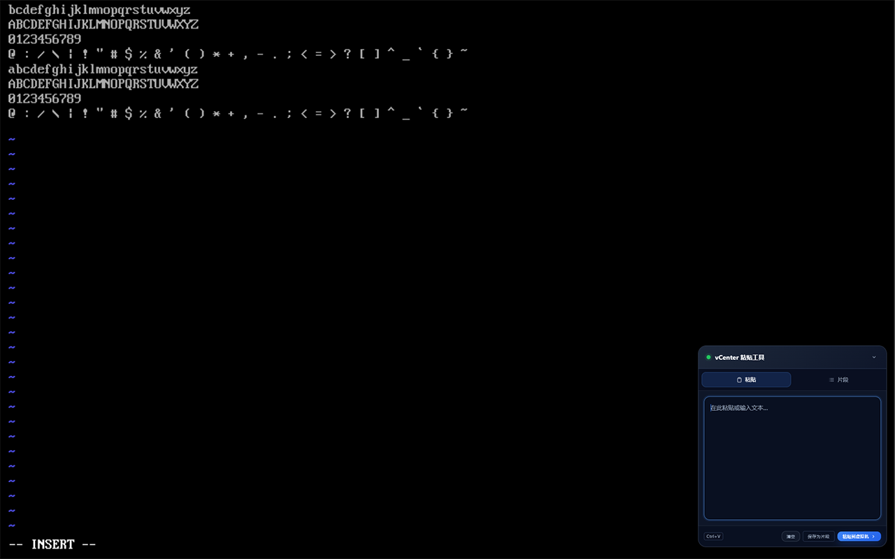
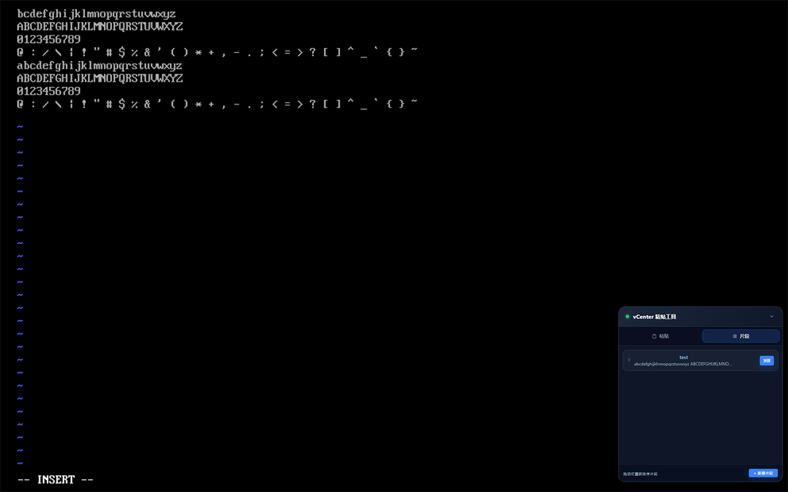
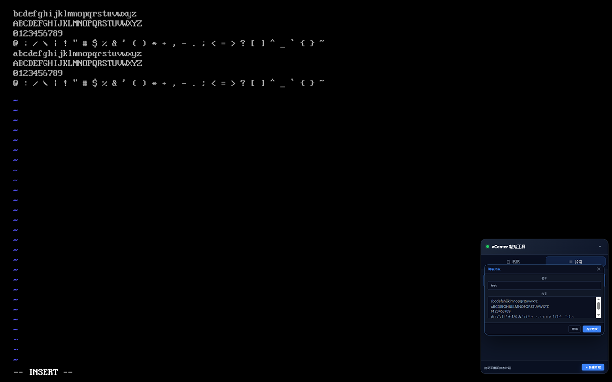
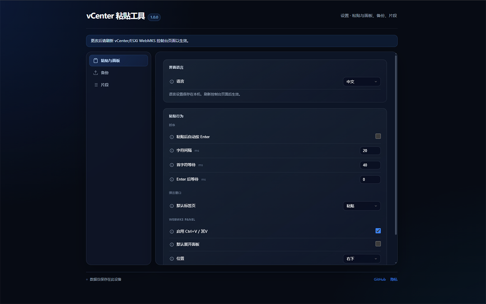
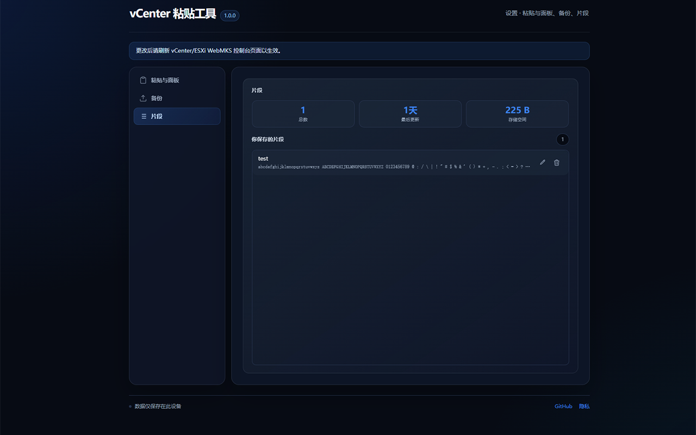

# vCenter Paste Assistant

**vCenter Paste Assistant** is a browser extension for Chrome, Edge, and Firefox. It types clipboard text and reusable command snippets into VMware vCenter or standalone ESXi Web Console (WebMKS), one key event at a time.

> Current version: **1.0.0**. The extension uses DOM `KeyboardEvent` simulation and does not require VMware Tools.

## Features

- Modern floating panel in detected WebMKS consoles
- `Ctrl+V` / `Command+V` support while the console is focused
- Editable text input and Send action in the extension popup
- Create, search, reorder, and edit reusable snippets
- Import and export snippets as JSON
- Configurable first-character, per-character, and newline delays
- Optional auto-Enter, long-paste progress, and cancellation
- Simplified Chinese by default, switchable to English in Extension options
- Clipboard text, snippets, and settings are processed locally

## Screenshots

### WebMKS floating paste panel



### Paste text



### Reusable snippets



### Extension popup



### Extension options



## Verified scenarios

### VMware environments

- vSphere Client 8
- ESXi 8.0.0
- ESXi 7.0.3
- ESXi 6.7.0

### Input scenarios

- Linux login shells
- Windows sign-in screens
- Lowercase and uppercase letters
- Digits and common symbols including `@ : / \ |`
- Single-line and multiline text
- vCenter/ESXi WebMKS consoles

## Test installation

1. Open [Releases](https://github.com/hkrt69iruk/vCenter-Paste-Assistant/releases/tag/v1.0.0) and download `vcenter-paste-assistant-v1.0.0.zip`.
2. Extract the release archive.
3. Open `chrome://extensions/` or `edge://extensions/`.
4. Enable **Developer mode**.
5. Click **Load unpacked**.
6. Select the extracted extension directory.
7. Open a VM Web Console in vCenter/ESXi and refresh the page.
8. Focus the console and send text from the floating panel or extension popup.

## Language settings

Simplified Chinese is used by default. Open the browser extension manager and go to:

**vCenter Paste Assistant → Details → Extension options → Language**

Select English, then refresh the vCenter/ESXi WebMKS console page.

## Usage

### Paste text

1. Focus the VM console.
2. Press `Ctrl+V` / `Command+V`, or open the floating panel.
3. Review the text to be sent.
4. Click **Paste into VM**.

### Manage snippets

- Create: enter a name and content, then save.
- Send: click **Send** next to a snippet.
- Reorder: drag snippets into the desired order.
- Migrate: import or export JSON from the settings page.

See [`example-snippets.json`](example-snippets.json) for sample data.

## Compatibility and limitations

- Text is converted to US-ANSI keyboard events and typed one character at a time.
- Newlines are converted to Enter.
- This is simulated keyboard input, not bidirectional clipboard synchronization.
- It is intended for shell commands, IP addresses, URLs, usernames, and ASCII text.
- Direct Unicode/Chinese input may depend on Guest OS input methods and WebMKS behavior.
- Multiline text may execute multiple commands; always review it before sending.
- HTTP/HTTPS host access is required because private vCenter/ESXi systems may use arbitrary hostnames or IP addresses. The UI appears only when WebMKS markers are detected.

## Project structure

```text
extension/              browser extension source
scripts/                build and verification scripts
assets/                 project artwork
/docs                    privacy and related documentation
example-snippets.json   sample snippets
README.zh-CN.md         Chinese documentation
README.en.md            English documentation
```

## Privacy

The extension does not upload clipboard text, snippets, or settings, and contains no analytics, tracking pixels, or remote logging. See the [Privacy Policy](docs/PRIVACY_POLICY.md).

## License

Licensed under the [MIT License](LICENSE). Original copyright notices for third-party-derived code are retained as required by the license.
